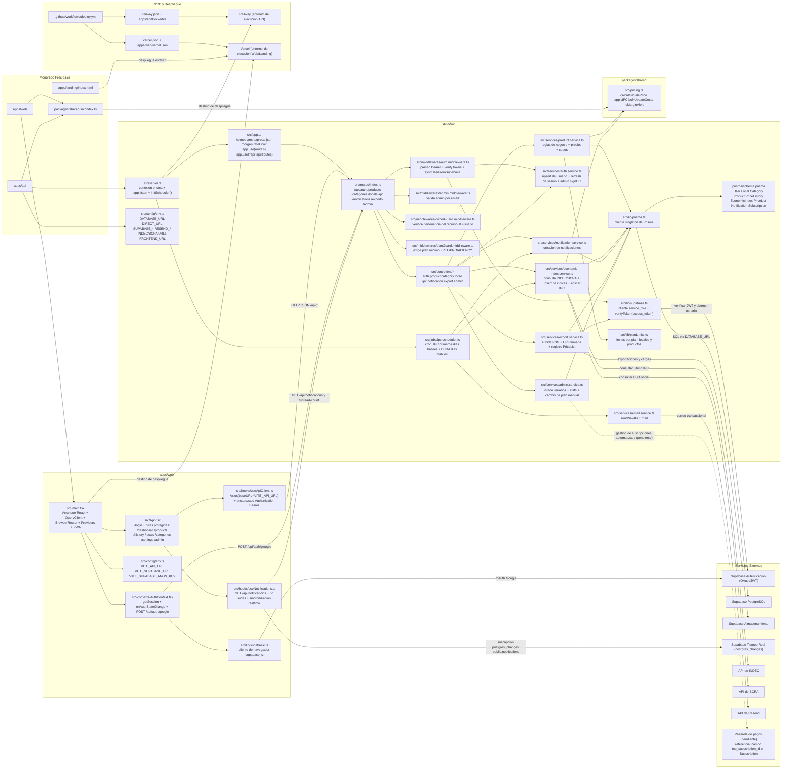

# UML Completo de PreciosYa (un solo Mermaid)

```mermaid
flowchart LR
  subgraph monorepo[Monorepo PreciosYa]
    webApp["apps/web"]
    apiApp["apps/api"]
    landingApp["apps/landing/index.html"]
    sharedPkg["packages/shared/src/index.ts"]
  end

  subgraph webLayer[apps/web]
    webEntry["src/main.tsx\nArranque React + QueryClient + BrowserRouter + Providers + PWA"]
    webRouter["src/App.tsx\n/login + rutas protegidas: /dashboard /products /history /locals /categories /settings /admin"]
    webAuthCtx["src/contexts/AuthContext.tsx\ngetSession + onAuthStateChange + POST /api/auth/google"]
    webApiClient["src/hooks/useApiClient.ts\nAxios(baseURL=VITE_API_URL) + encabezado Authorization Bearer"]
    webNotifHook["src/hooks/useNotifications.ts\nGET /api/notifications + no leidas + sincronizacion realtime"]
    webSbClient["src/lib/supabase.ts\ncliente de navegador supabase-js"]
    webEnv["src/config/env.ts\nVITE_API_URL VITE_SUPABASE_URL VITE_SUPABASE_ANON_KEY"]
  end

  subgraph apiLayer[apps/api]
    apiServer["src/server.ts\nconexion prisma + app.listen + initScheduler()"]
    apiAppEntry["src/app.ts\nhelmet cors express.json morgan rateLimit app.use(routes) app.use('/api',apiRoutes)"]
    apiRoutes["src/routes/index.ts\n/api/auth /products /categories /locals /ipc /notifications /exports /admin"]
    apiAuthMw["src/middlewares/auth.middleware.ts\nparseo Bearer + verifyToken + syncUserFromSupabase"]
    apiAdminMw["src/middlewares/admin.middleware.ts\nvalida admin por email"]
    apiOwnerGuard["src/middlewares/ownerGuard.middleware.ts\nverifica pertenencia del recurso al usuario"]
    apiPlanGuard["src/middlewares/planGuard.middleware.ts\nexige plan minimo FREE/PRO/AGENCY"]
    apiControllers["src/controllers/*\nauth product category local ipc notification export admin"]
    apiAdminService["src/services/admin.service.ts\nlistado usuarios + stats + cambio de plan manual"]
    apiAuthService["src/services/auth.service.ts\nupsert de usuario + refresh de sesion + admin signOut"]
    apiProductService["src/services/product.service.ts\nreglas de negocio + precios + cupos"]
    apiEconService["src/services/economic-index.service.ts\nconsulta INDEC/BCRA + upsert de indices + aplicar IPC"]
    apiNotifService["src/services/notification.service.ts\ncreacion de notificaciones"]
    apiExportService["src/services/export.service.ts\nsubida PNG + URL firmada + registro PriceList"]
    apiEmailService["src/services/email.service.ts\nsendNewIPCEmail"]
    apiScheduler["src/jobs/ipc-scheduler.ts\ncron: IPC primeros dias habiles + BCRA dias habiles"]
    apiPrisma["src/lib/prisma.ts\ncliente singleton de Prisma"]
    apiPlanLimits["src/lib/planLimits.ts\nlimites por plan: locales y productos"]
    apiSbAdmin["src/lib/supabase.ts\ncliente service_role + verifyToken(access_token)"]
    apiSchema["prisma/schema.prisma\nUser Local Category Product PriceHistory EconomicIndex PriceList Notification Subscription"]
    apiEnv["src/config/env.ts\nDATABASE_URL DIRECT_URL SUPABASE_* RESEND_* INDEC/BCRA URLs FRONTEND_URL"]
  end

  subgraph sharedLayer[packages/shared]
    sharedPricing["src/pricing.ts\ncalculateSalePrice applyIPC bulkUpdateCosts isMarginAlert"]
  end

  subgraph externalServices[Servicios Externos]
    supaAuth["Supabase Autenticacion (OAuth/JWT)"]
    supaDb["Supabase PostgreSQL"]
    supaStorage["Supabase Almacenamiento"]
    supaRealtime["Supabase Tiempo Real (postgres_changes)"]
    indecApi["API de INDEC"]
    bcraApi["API de BCRA"]
    resendApi["API de Resend"]
    paymentGateway["Pasarela de pagos (pendiente)\nreferencia: campo mp_subscription_id en Subscription"]
  end

  subgraph delivery[CI/CD y Despliegue]
    ghDeploy[".github/workflows/deploy.yml"]
    railwayCfg["railway.json + apps/api/Dockerfile"]
    vercelCfg["vercel.json + apps/web/vercel.json"]
    railway["Railway (entorno de ejecucion API)"]
    vercel["Vercel (entorno de ejecucion Web/Landing)"]
  end

  webApp --> webEntry
  webEntry --> webRouter
  webEntry --> webAuthCtx
  webEntry --> webEnv
  webAuthCtx --> webSbClient
  webRouter --> webApiClient
  webRouter --> webNotifHook
  webApp --> sharedPkg

  apiApp --> apiServer
  apiServer --> apiAppEntry
  apiServer --> apiScheduler
  apiApp --> apiEnv
  apiApp --> sharedPkg
  sharedPkg --> sharedPricing
  apiAppEntry --> apiRoutes
  apiRoutes --> apiAuthMw
  apiRoutes --> apiAdminMw
  apiRoutes --> apiOwnerGuard
  apiRoutes --> apiPlanGuard
  apiRoutes --> apiControllers
  apiAuthMw --> apiSbAdmin
  apiAuthMw --> apiAuthService
  apiControllers --> apiAuthService
  apiControllers --> apiAdminService
  apiControllers --> apiProductService
  apiControllers --> apiEconService
  apiControllers --> apiNotifService
  apiControllers --> apiExportService
  apiProductService --> apiPrisma
  apiProductService --> apiPlanLimits
  apiProductService --> sharedPricing
  apiEconService --> apiPrisma
  apiEconService --> sharedPricing
  apiNotifService --> apiPrisma
  apiExportService --> apiPrisma
  apiExportService --> apiSbAdmin
  apiPrisma --> apiSchema
  apiAdminService --> apiPrisma
  apiScheduler --> apiEconService
  apiScheduler --> apiNotifService
  apiScheduler --> apiEmailService

  webApiClient -->|"HTTP JSON /api/*"| apiRoutes
  webAuthCtx -->|"POST /api/auth/google"| apiRoutes
  webNotifHook -->|"GET /api/notifications y /unread-count"| apiRoutes
  webSbClient -->|"OAuth Google"| supaAuth
  webNotifHook -->|"suscripcion postgres_changes public.notifications"| supaRealtime

  apiSbAdmin -->|"verificar JWT y obtener usuario"| supaAuth
  apiPrisma -->|"SQL via DATABASE_URL"| supaDb
  apiExportService -->|"exportaciones y cargas"| supaStorage
  apiEconService -->|"consultar ultimo IPC"| indecApi
  apiEconService -->|"consultar USD oficial"| bcraApi
  apiEmailService -->|"correo transaccional"| resendApi
  apiAdminService -.->|"gestion de suscripciones automatizada (pendiente)"| paymentGateway

  ghDeploy --> railwayCfg
  ghDeploy --> vercelCfg
  railwayCfg --> railway
  vercelCfg --> vercel
  apiServer -->|"destino de despliegue"| railway
  webEntry -->|"destino de despliegue"| vercel
  landingApp -->|"despliegue estatico"| vercel
```
