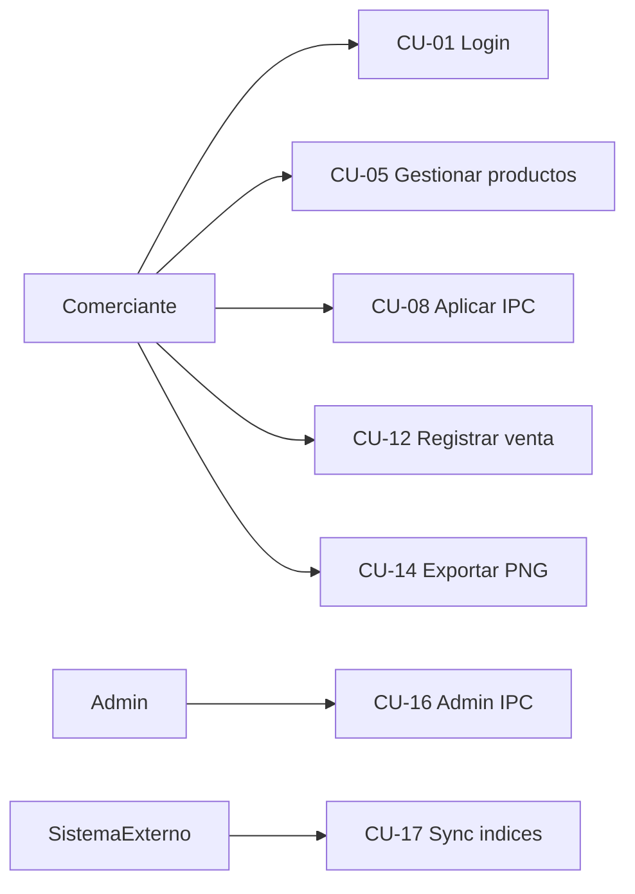

# Casos de uso — PreciosYa

## Actores

| Actor | Descripción |
|-------|-------------|
| **Comerciante** | Dueño o encargado del negocio (plan Free/Pro/Agency) |
| **Administrador** | Usuario con `is_admin`; gestiona IPC global y usuarios |
| **Sistema externo** | INDEC/Alphacast, BCRA, Google OAuth, Supabase |

---

## Diagrama general

---

## Casos de uso detallados

### CU-01 — Iniciar sesión con Google
- **Actor:** Comerciante
- **RF:** RF-W001
- **Precondición:** Cuenta Google válida
- **Flujo principal:** 1) Abre app → 2) Toca Google → 3) OAuth Supabase → 4) API crea/recupera user → 5) Redirige dashboard
- **Postcondición:** Sesión JWT activa

### CU-02 — Crear local
- **Actor:** Comerciante | **RF:** RF-W010
- **Precondición:** Logueado; bajo límite plan
- **Flujo:** Settings/Locales → Nuevo → nombre → guardar
- **Postcondición:** Local activo en selector

### CU-03 — Activar rubros
- **Actor:** Comerciante | **RF:** RF-W012, RF-W013
- **Flujo:** Categorías → toggle rubro → opcional Indexar USD
- **Postcondición:** Rubro activo para productos e índices

### CU-04 — Alta producto con escáner
- **Actor:** Comerciante | **RF:** RF-W020, RF-W021
- **Flujo:** Productos → Nuevo → escanear barcode → costo + margen → guardar
- **Postcondición:** Producto con precio calculado

### CU-05 — Editar producto
- **Actor:** Comerciante | **RF:** RF-W020
- **Flujo:** Tap producto → modificar costo/margen → guardar
- **Postcondición:** `price_history` registra cambio MANUAL

### CU-06 — Ver alertas de margen
- **Actor:** Comerciante | **RF:** RF-W022, RF-W041
- **Flujo:** Dashboard muestra count → Productos filtro alertas
- **Postcondición:** Usuario identifica productos bajo mínimo

### CU-07 — Actualización masiva por %
- **Actor:** Comerciante | **RF:** RF-W033
- **Flujo:** Productos → Actualizar → % → preview → confirmar
- **Postcondición:** Costos actualizados; historial BULK_PCT

### CU-08 — Aplicar IPC al local
- **Actor:** Comerciante | **RF:** RF-W031
- **Precondición:** IPC del mes disponible; rubros IPC activos
- **Flujo:** Banner IPC → desglose por rubro → confirmar
- **Postcondición:** Costos actualizados; `last_ipc_applied_period` set

### CU-09 — Aplicar variación USD
- **Actor:** Comerciante | **RF:** RF-W032
- **Precondición:** Rubros con Indexar USD; cotización BCRA
- **Flujo:** Banner USD → apply-usd → confirmar
- **Postcondición:** Solo productos USD actualizados

### CU-10 — Consultar historial de precios
- **Actor:** Comerciante | **RF:** RF-W034
- **Flujo:** Historial → elegir producto → gráfico + tabla
- **Postcondición:** Usuario ve evolución y motivos

### CU-11 — Consultar resumen ventas
- **Actor:** Comerciante | **RF:** RF-W051
- **Flujo:** Ventas → Resumen → filtrar período
- **Postcondición:** KPIs y gráficos visibles (según plan)

### CU-12 — Registrar venta (carga del día)
- **Actor:** Comerciante | **RF:** RF-W050
- **Flujo:** Ventas → Registrar → escanear/buscar ítems → ajustar qty → fecha/hora → confirmar
- **Postcondición:** `sales` + `sale_lines` con snapshots

### CU-13 — Consultar historial ventas
- **Actor:** Comerciante | **RF:** RF-W052
- **Flujo:** Ventas → Historial → expandir venta
- **Postcondición:** Detalle líneas visible (Free: 7 días)

### CU-14 — Exportar lista PNG
- **Actor:** Comerciante | **RF:** RF-W040
- **Flujo:** Productos → Exportar → preview → compartir/descargar
- **Postcondición:** PNG en Storage + registro `price_lists`

### CU-15 — Consultar plan y mejorar
- **Actor:** Comerciante | **RF:** RF-W060, RF-W061
- **Flujo:** Settings → Plan → modal → mailto Pro/Agency
- **Postcondición:** Usuario informado de límites

### CU-16 — Admin: forzar IPC / gestionar usuarios
- **Actor:** Administrador | **RF:** RF-W062
- **Precondición:** `is_admin`
- **Flujo:** Admin → sync IPC o cambiar plan usuario
- **Postcondición:** Índices o plan actualizado

### CU-17 — Sincronizar índices (automático)
- **Actor:** Sistema (cron) | **RF:** RF-W030
- **Flujo:** Scheduler → fetch Alphacast/BCRA → upsert `economic_indices`
- **Postcondición:** Datos disponibles para CU-08/CU-09

### CU-18 — Instalar APK Android
- **Actor:** Comerciante | **RF:** RF-A001 … RF-A004
- **Flujo:** Landing descargar → instalar → abrir TWA → login
- **Postcondición:** Misma app web en contenedor Android

---

## Matriz actor × caso de uso

| CU | Comerciante | Admin | Sistema |
|----|:-----------:|:-----:|:-------:|
| 01-15, 18 | ✓ | | |
| 16 | | ✓ | |
| 17 | | | ✓ |
