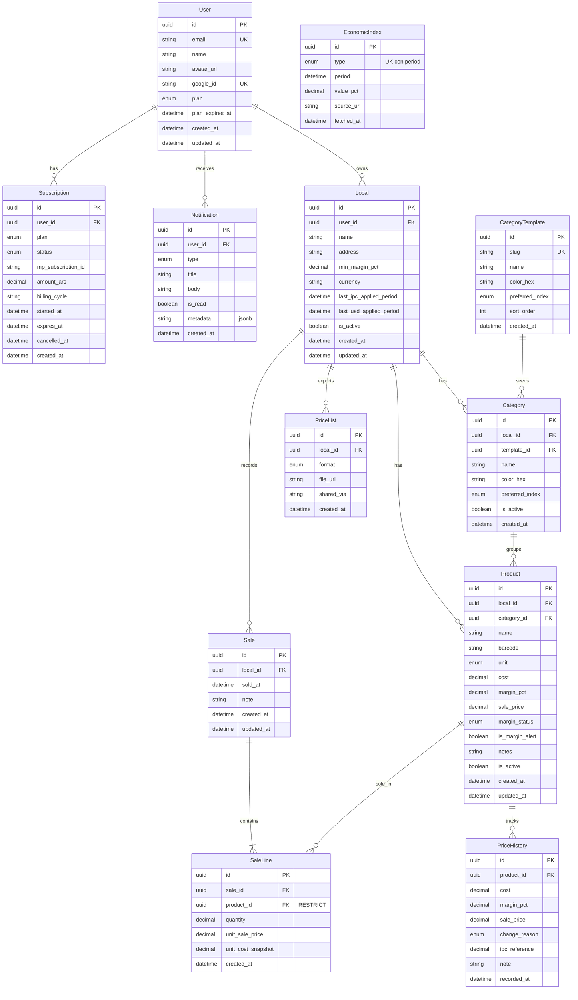

# DER — Diagrama Entidad-Relación (PreciosYa)

**Fuente de verdad:** [`apps/api/prisma/schema.prisma`](../../apps/api/prisma/schema.prisma)  
**Motor:** PostgreSQL 15 (Supabase) · **ORM:** Prisma 5  
**Última sincronización:** junio 2026 (v2: rubros COICOP, ventas, `margin_status`, `category_templates`)

---

## Diagrama (Mermaid)

> `economic_indices` no tiene FK hacia otras tablas: el API la consulta por `type` + `period` al aplicar IPC/USD.

---

## Entidades (12 tablas)

### `users`

| Columna | Tipo | Restricciones | Descripción |
|---------|------|---------------|-------------|
| `id` | UUID | PK, default `gen_random_uuid()` | Identificador |
| `email` | String | UNIQUE, NOT NULL | Email Google |
| `name` | String | NOT NULL | Nombre visible |
| `avatar_url` | String | NULL | Foto perfil OAuth |
| `google_id` | String | UNIQUE, NULL | ID Google |
| `plan` | `PlanType` | NOT NULL, default FREE | Plan actual |
| `plan_expires_at` | DateTime | NULL | Vencimiento Pro/Agency |
| `created_at` | DateTime | NOT NULL | Alta |
| `updated_at` | DateTime | NOT NULL | Última modificación |

**Relaciones:** 1:N → `locals`, `notifications`, `subscriptions`

---

### `locals`

| Columna | Tipo | Restricciones | Descripción |
|---------|------|---------------|-------------|
| `id` | UUID | PK | Identificador |
| `user_id` | UUID | FK → `users.id`, ON DELETE CASCADE | Dueño |
| `name` | String | NOT NULL | Nombre del negocio |
| `address` | String | NULL | Dirección opcional |
| `min_margin_pct` | Decimal(5,2) | NOT NULL, default 20.00 | Margen mínimo alerta |
| `currency` | String | NOT NULL, default ARS | Moneda |
| `last_ipc_applied_period` | DateTime | NULL | Mes IPC ya aplicado |
| `last_usd_applied_period` | DateTime | NULL | Día USD ya aplicado |
| `is_active` | Boolean | NOT NULL, default true | Soft scope |
| `created_at` / `updated_at` | DateTime | NOT NULL | Auditoría |

**Relaciones:** N:1 → `users`; 1:N → `categories`, `products`, `price_lists`, `sales`

---

### `category_templates`

| Columna | Tipo | Restricciones | Descripción |
|---------|------|---------------|-------------|
| `id` | UUID | PK | Identificador |
| `slug` | String | UNIQUE, NOT NULL | Clave COICOP/INDEC |
| `name` | String | NOT NULL | Nombre rubro seed |
| `color_hex` | String | NOT NULL, default #16A34A | Color UI |
| `preferred_index` | `IndexType` | NOT NULL, default IPC_INDEC | Índice por defecto |
| `sort_order` | Int | NOT NULL, default 0 | Orden en UI |
| `created_at` | DateTime | NOT NULL | Alta seed |

**Relaciones:** 1:N → `categories` (opcional vía `template_id`)

---

### `categories`

| Columna | Tipo | Restricciones | Descripción |
|---------|------|---------------|-------------|
| `id` | UUID | PK | Identificador |
| `local_id` | UUID | FK → `locals.id`, ON DELETE CASCADE | Local |
| `template_id` | UUID | FK → `category_templates.id`, ON DELETE SET NULL | Template COICOP |
| `name` | String | NOT NULL | Nombre rubro en el local |
| `color_hex` | String | NULL | Override color |
| `preferred_index` | `IndexType` | NOT NULL | IPC serie o BCRA_USD_* si indexa USD |
| `is_active` | Boolean | NOT NULL, default true | Rubro activo |
| `created_at` | DateTime | NOT NULL | Alta |

**Únicos:** `(local_id, name)`, `(local_id, template_id)`  
**Relaciones:** N:1 → `locals`, `category_templates`; 1:N → `products`

---

### `products`

| Columna | Tipo | Restricciones | Descripción |
|---------|------|---------------|-------------|
| `id` | UUID | PK | Identificador |
| `local_id` | UUID | FK → `locals.id`, ON DELETE CASCADE | Local |
| `category_id` | UUID | FK → `categories.id`, ON DELETE SET NULL | Rubro |
| `name` | String | NOT NULL | Nombre producto |
| `barcode` | String | NULL | EAN/UPC opcional |
| `unit` | `ProductUnit` | NOT NULL, default unidad | Unidad de medida |
| `cost` | Decimal(12,2) | NOT NULL | Costo reposición |
| `margin_pct` | Decimal(5,2) | NOT NULL | Margen % sobre costo |
| `sale_price` | Decimal(12,2) | NOT NULL | Precio calculado (servicio) |
| `margin_status` | `MarginStatus` | NOT NULL, default OK | LOW / WARNING / OK |
| `is_margin_alert` | Boolean | NOT NULL, default false | Alerta vs `min_margin_pct` local |
| `notes` | String | NULL | Notas libres |
| `is_active` | Boolean | NOT NULL, default true | Soft delete |
| `created_at` / `updated_at` | DateTime | NOT NULL | Auditoría |

**Único:** `(local_id, barcode)` donde `barcode` IS NOT NULL  
**Relaciones:** N:1 → `locals`, `categories`; 1:N → `price_history`, `sale_lines`

---

### `price_history`

Tabla **append-only** (sin UPDATE ni DELETE en aplicación; trigger en Postgres).

| Columna | Tipo | Restricciones | Descripción |
|---------|------|---------------|-------------|
| `id` | UUID | PK | Identificador |
| `product_id` | UUID | FK → `products.id`, ON DELETE CASCADE | Producto |
| `cost` | Decimal(12,2) | NOT NULL | Snapshot costo |
| `margin_pct` | Decimal(5,2) | NOT NULL | Snapshot margen |
| `sale_price` | Decimal(12,2) | NOT NULL | Snapshot precio venta |
| `change_reason` | `ChangeReason` | NOT NULL | Motivo cambio |
| `ipc_reference` | Decimal(5,2) | NULL | % IPC si aplica |
| `note` | String | NULL | Nota libre |
| `recorded_at` | DateTime | NOT NULL, default now() | Momento registro |

**Relaciones:** N:1 → `products`

---

### `economic_indices`

Catálogo global de índices (sin FK a locales/productos).

| Columna | Tipo | Restricciones | Descripción |
|---------|------|---------------|-------------|
| `id` | UUID | PK | Identificador |
| `type` | `IndexType` | NOT NULL | Serie IPC o USD |
| `period` | DateTime | NOT NULL | Primer día del mes (IPC) o día (USD) |
| `value_pct` | Decimal(6,3) | NOT NULL | Variación % |
| `source_url` | String | NULL | URL fuente o metadata BCRA |
| `fetched_at` | DateTime | NOT NULL, default now() | Última sincronización |

**Único:** `(type, period)`

---

### `price_lists`

| Columna | Tipo | Restricciones | Descripción |
|---------|------|---------------|-------------|
| `id` | UUID | PK | Identificador |
| `local_id` | UUID | FK → `locals.id`, ON DELETE CASCADE | Local |
| `format` | `ExportFormat` | NOT NULL | PNG (v1); PDF planificado |
| `file_url` | String | NULL | URL Supabase Storage |
| `shared_via` | String | NULL | whatsapp, download, etc. |
| `created_at` | DateTime | NOT NULL | Exportación |

**Relaciones:** N:1 → `locals`

---

### `notifications`

| Columna | Tipo | Restricciones | Descripción |
|---------|------|---------------|-------------|
| `id` | UUID | PK | Identificador |
| `user_id` | UUID | FK → `users.id`, ON DELETE CASCADE | Destinatario |
| `type` | `NotifType` | NOT NULL | Tipo alerta |
| `title` | String | NOT NULL | Título |
| `body` | String | NOT NULL | Cuerpo |
| `is_read` | Boolean | NOT NULL, default false | Leída |
| `metadata` | Json | NULL | Payload extra |
| `created_at` | DateTime | NOT NULL | Creación |

**Relaciones:** N:1 → `users`

---

### `subscriptions`

| Columna | Tipo | Restricciones | Descripción |
|---------|------|---------------|-------------|
| `id` | UUID | PK | Identificador |
| `user_id` | UUID | FK → `users.id`, ON DELETE CASCADE | Usuario |
| `plan` | `PlanType` | NOT NULL | PRO / AGENCY |
| `status` | `SubStatus` | NOT NULL | ACTIVE, CANCELLED, etc. |
| `mp_subscription_id` | String | NULL | ID Mercado Pago |
| `amount_ars` | Decimal(10,2) | NOT NULL | Monto mensual |
| `billing_cycle` | String | NOT NULL, default monthly | Ciclo |
| `started_at` | DateTime | NOT NULL | Inicio |
| `expires_at` | DateTime | NULL | Fin |
| `cancelled_at` | DateTime | NULL | Cancelación |
| `created_at` | DateTime | NOT NULL | Alta registro |

**Relaciones:** N:1 → `users`

---

### `sales`

Cabecera de venta (gestor lite, sin POS).

| Columna | Tipo | Restricciones | Descripción |
|---------|------|---------------|-------------|
| `id` | UUID | PK | Identificador |
| `local_id` | UUID | FK → `locals.id`, ON DELETE CASCADE | Local |
| `sold_at` | DateTime | NOT NULL | Fecha/hora venta (TZ AR en servicio) |
| `note` | String | NULL | Nota opcional |
| `created_at` / `updated_at` | DateTime | NOT NULL | Auditoría |

**Relaciones:** N:1 → `locals`; 1:N → `sale_lines`

---

### `sale_lines`

Líneas con **snapshot** de rentabilidad al momento de la venta.

| Columna | Tipo | Restricciones | Descripción |
|---------|------|---------------|-------------|
| `id` | UUID | PK | Identificador |
| `sale_id` | UUID | FK → `sales.id`, ON DELETE CASCADE | Venta |
| `product_id` | UUID | FK → `products.id`, ON DELETE **RESTRICT** | Producto |
| `quantity` | Decimal(10,3) | NOT NULL | Cantidad |
| `unit_sale_price` | Decimal(12,2) | NOT NULL | Precio venta al momento |
| `unit_cost_snapshot` | Decimal(12,2) | NOT NULL | Costo al momento |
| `created_at` | DateTime | NOT NULL | Alta línea |

**Relaciones:** N:1 → `sales`, `products`

---

## Enums

### `PlanType`

| Valor | Uso |
|-------|-----|
| `FREE` | 30 productos, 1 local |
| `PRO` | Ilimitado productos, 3 locales |
| `AGENCY` | Multi-local a medida |

### `ChangeReason`

| Valor | Uso |
|-------|-----|
| `MANUAL` | Edición costo/margen |
| `BULK_PCT` | Actualización masiva % |
| `IPC_INDEC` | Aplicar IPC por rubro |
| `BCRA_RATE` | Aplicar variación USD |
| `IMPORT` | Importación / carga |

### `IndexType`

| Valor | Uso |
|-------|-----|
| `IPC_INDEC` | IPC nivel general |
| `IPC_INDEC_ALIMENTOS` | División alimentos |
| `IPC_INDEC_BEBIDAS` | Bebidas |
| `IPC_INDEC_VESTIMENTA` | Vestimenta |
| `IPC_INDEC_VIVIENDA` | Vivienda |
| `IPC_INDEC_HOGAR` | Hogar |
| `IPC_INDEC_SALUD` | Salud |
| `IPC_INDEC_TRANSPORTE` | Transporte |
| `IPC_INDEC_COMUNICACION` | Comunicación |
| `IPC_INDEC_RECREACION` | Recreación |
| `IPC_INDEC_EDUCACION` | Educación |
| `IPC_INDEC_RESTAURANTES` | Restaurantes |
| `IPC_INDEC_VARIOS` | Varios |
| `BCRA_USD_OFICIAL` | Dólar oficial BCRA |
| `BCRA_USD_MEP` | Reservado / futuro |

### `MarginStatus`

| Valor | Uso |
|-------|-----|
| `LOW` | Margen bajo mínimo |
| `WARNING` | Cerca del mínimo |
| `OK` | Margen saludable |

### `ProductUnit`

`unidad`, `kg`, `g`, `lt`, `ml`, `pack`, `docena`, `caja`

### `ExportFormat`

| Valor | Uso |
|-------|-----|
| `PNG` | Export v1 (WhatsApp) |
| `PDF` | Planificado v2 |

### `NotifType`

| Valor | Uso |
|-------|-----|
| `NEW_IPC` | Nuevo IPC disponible |
| `BCRA_USD_ALERT` | Salto fuerte USD |
| `MARGIN_ALERT` | Producto bajo margen mínimo |
| `PLAN_EXPIRING` | Plan por vencer |
| `PLAN_EXPIRED` | Plan vencido |
| `WELCOME` | Bienvenida |

### `SubStatus`

| Valor | Uso |
|-------|-----|
| `ACTIVE` | Suscripción vigente |
| `CANCELLED` | Cancelada |
| `EXPIRED` | Vencida |
| `PENDING` | Pendiente activación |

---

## Relaciones resumidas

| Origen | Cardinalidad | Destino | ON DELETE |
|--------|--------------|---------|-----------|
| `users` | 1:N | `locals` | CASCADE |
| `users` | 1:N | `notifications` | CASCADE |
| `users` | 1:N | `subscriptions` | CASCADE |
| `locals` | 1:N | `categories` | CASCADE |
| `locals` | 1:N | `products` | CASCADE |
| `locals` | 1:N | `price_lists` | CASCADE |
| `locals` | 1:N | `sales` | CASCADE |
| `category_templates` | 1:N | `categories` | SET NULL |
| `categories` | 1:N | `products` | SET NULL |
| `products` | 1:N | `price_history` | CASCADE |
| `products` | 1:N | `sale_lines` | **RESTRICT** |
| `sales` | 1:N | `sale_lines` | CASCADE |

---

## Reglas de integridad y negocio

1. **`price_history`:** append-only. Trigger `trg_products_price_history` en Postgres inserta fila al cambiar `cost` o `margin_pct` en `products`. La API no hace UPDATE/DELETE sobre historial.
2. **`sale_lines.product_id`:** `ON DELETE RESTRICT` — no se puede borrar un producto con líneas de venta (preserva rentabilidad histórica).
3. **`products.sale_price`:** siempre recalculado en capa de servicio (`PricingEngine`), nunca confiado del cliente.
4. **`economic_indices`:** upsert por `(type, period)` desde jobs cron y carga admin.
5. **`locals.last_ipc_applied_period` / `last_usd_applied_period`:** idempotencia de aplicación masiva IPC/USD.
6. **Planes:** límites Free/Pro enforced en `product.service` y `local.service` (no RLS en Supabase).

---

## Índices (Prisma / Postgres)

| Tabla | Índice | Propósito |
|-------|--------|-----------|
| `products` | `(local_id, is_active)` | Listado catálogo |
| `products` | `(barcode)` | Escáner / búsqueda |
| `price_history` | `(product_id, recorded_at DESC)` | Gráfico historial |
| `economic_indices` | `(type, period DESC)` | Último índice por serie |
| `sales` | `(local_id, sold_at DESC)` | Dashboard ventas |
| `sale_lines` | `(sale_id)`, `(product_id)` | Detalle y agregados |

**Únicos adicionales:** ver sección por entidad (`email`, `google_id`, `slug`, `(type, period)`, etc.).

---

## Triggers manuales (Supabase)

Definidos en [`apps/api/prisma/migrations/manual/triggers.sql`](../../apps/api/prisma/migrations/manual/triggers.sql):

- `record_price_change()` → insert en `price_history` al actualizar producto
- `set_updated_at()` → `updated_at` en `users`, `locals`, `products`

---

## Trazabilidad

- **API:** servicios Prisma en `apps/api/src/services/`
- **RF:** RF-W relacionados con persistencia en [`REQUISITOS_FUNCIONALES_WEB.md`](./REQUISITOS_FUNCIONALES_WEB.md)
- **Migraciones:** `apps/api/prisma/migrations/`
