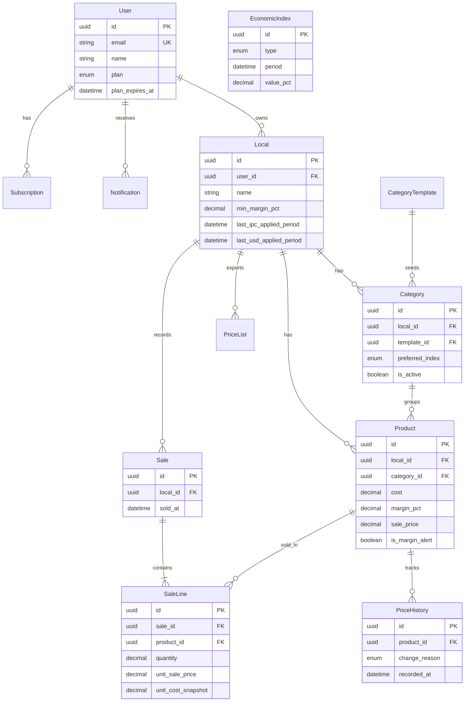

# DER — Diagrama Entidad-Relación (PreciosYa)

**Fuente de verdad:** [`apps/api/prisma/schema.prisma`](../../apps/api/prisma/schema.prisma)

## Diagrama (Mermaid)

## Entidades (13 tablas)

| Tabla | Descripción |
|-------|-------------|
| `users` | Cuenta Google; plan Free/Pro/Agency |
| `locals` | Sucursal/negocio del usuario |
| `category_templates` | Catálogo COICOP/INDEC seed |
| `categories` | Rubros activos por local |
| `products` | Artículos con costo, margen, precio |
| `price_history` | Append-only cambios de precio |
| `economic_indices` | IPC y USD históricos |
| `price_lists` | Registro exports PNG |
| `notifications` | Alertas in-app |
| `subscriptions` | Suscripciones (manual v1) |
| `sales` | Cabecera venta |
| `sale_lines` | Líneas con snapshots |

## Enums principales

| Enum | Valores relevantes |
|------|-------------------|
| `PlanType` | FREE, PRO, AGENCY |
| `ChangeReason` | MANUAL, BULK_PCT, IPC_INDEC, BCRA_RATE, IMPORT |
| `IndexType` | IPC_INDEC_*, BCRA_USD_OFICIAL |
| `NotifType` | NEW_IPC, BCRA_USD_ALERT, MARGIN_ALERT, … |

## Reglas de integridad

- `sale_lines.product_id` → `ON DELETE RESTRICT` (preserva historial).
- `products`, `categories` → cascade con `local`.
- `price_history` nunca se actualiza ni borra (trigger Postgres + política app).

## Índices de performance

- `products(local_id, is_active)`
- `price_history(product_id, recorded_at DESC)`
- `sales(local_id, sold_at DESC)`
- `economic_indices(type, period DESC)`
