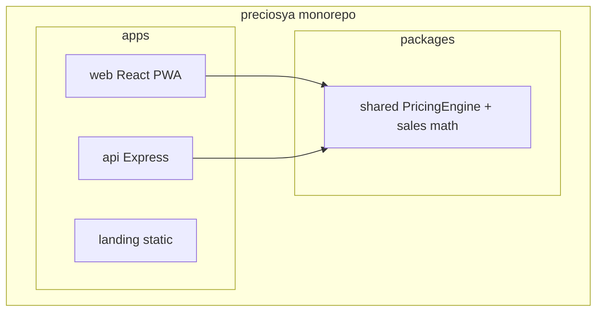
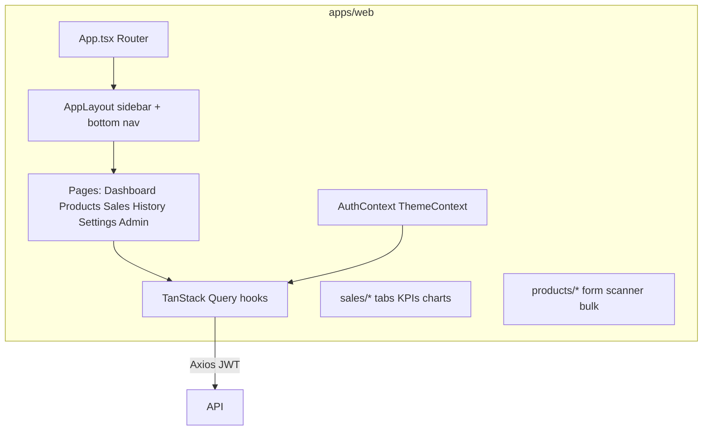
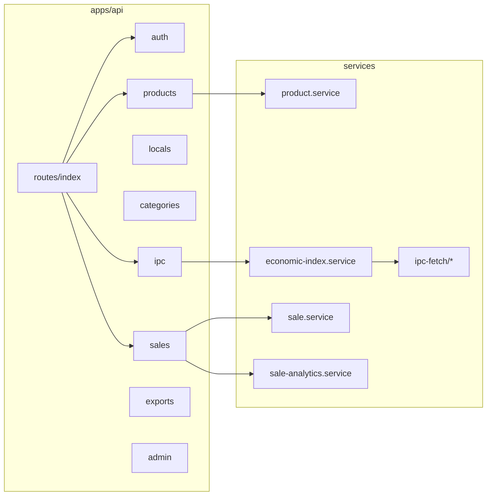
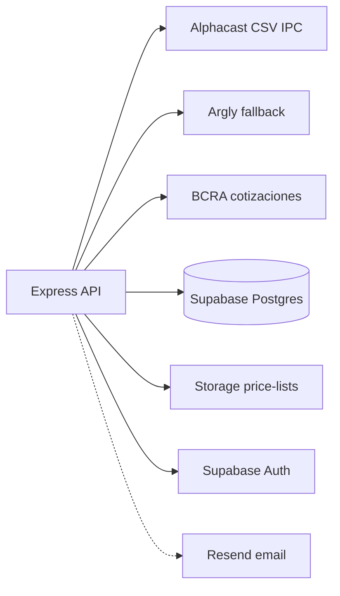

# Diagrama de componentes — PreciosYa

## Monorepo

---

## Frontend — componentes principales

| Módulo UI | Ruta | Responsabilidad |
|-----------|------|-----------------|
| Dashboard | `/dashboard` | KPIs, acciones rápidas |
| Productos | `/products` | CRUD, IPC/USD banners, export |
| Ventas | `/sales` | Registrar, resumen, historial, análisis |
| Historial | `/history` | IPC charts + bitácora producto |
| Rubros | `/categories` | Activar COICOP, toggle USD |
| Locales | `/locals` | CRUD locales |
| Ajustes | `/settings` | Cuenta, plan modal |
| Admin | `/admin` | IPC manual, usuarios |

---

## Backend — servicios y rutas

---

## Integraciones externas

---

## Paquete compartido (`packages/shared`)

| Módulo | Funciones |
|--------|-----------|
| `pricing.ts` | `calculateSalePrice`, `applyIPC`, `bulkUpdateCosts`, … |
| `sales.ts` | `lineRevenue`, `lineProfit`, `averageTicket` |
| `units.ts` | Enum unidades producto |

Tests Vitest en `packages/shared/src/__tests__/`.

---

## Schedulers

| Job | Cron | Acción |
|-----|------|--------|
| IPC mensual | 1er día hábil 9:00 | Fetch IPC → `economic_indices` → notif NEW_IPC |
| BCRA diario | 03:30 AR | USD oficial → variación diaria |

Archivo: `apps/api/src/jobs/ipc-scheduler.ts`
