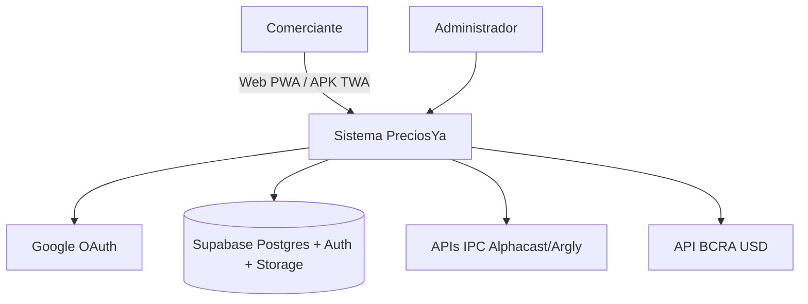
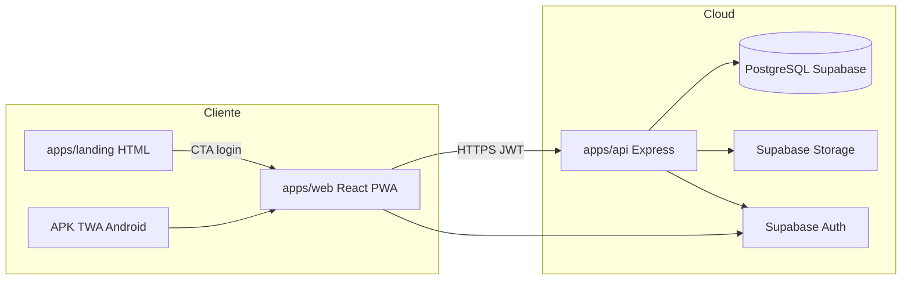

# Diseño de arquitectura — PreciosYa

## 1. Contexto (C4 — Nivel 1)



**Problema:** comercios minoristas argentinos actualizan precios manualmente y pierden margen con la inflación.

**Solución:** SaaS mobile-first que centraliza catálogo, aplica índices oficiales y estima rentabilidad por ventas registradas.

---

## 2. Contenedores (C4 — Nivel 2)



| Contenedor | Tecnología | Deploy |
|------------|------------|--------|
| Web | React 19, Vite, TanStack Query, Tailwind v4 | Vercel `preciosya.vercel.app` |
| API | Node 20, Express 5, Prisma, Zod | Railway |
| DB | PostgreSQL 15 | Supabase |
| Landing | HTML estático + GSAP | Vercel `preciosya-landing.vercel.app` |

---

## 3. Decisiones arquitectónicas (ADR resumidas)

| Decisión | Elección | Motivo |
|----------|----------|--------|
| Auth | Supabase Google OAuth + JWT propio en API | SSO simple; control de negocio en Express |
| RLS | **Desactivado** | Autorización en middlewares (`authMiddleware`, `ownerGuard`) |
| Precios | `PricingEngine` en `packages/shared` | Cálculo único testeado web+api |
| Ventas | Snapshots en `sale_lines` | Rentabilidad histórica aunque cambie IPC después |
| IPC | Multi-serie por rubro COICOP | Alineado INDEC; fallback Argly |
| TZ ventas | `America/Argentina/Buenos_Aires` | KPIs “hoy” correctos |
| APK | TWA, no React Native | Mismo código web; menor costo tesis |
| Offline | Cache PWA lectura; ventas online v1 | Complejidad outbox postergada v2 |

---

## 4. Capas backend (`apps/api`)

```
routes/ → controllers/ → services/ → prisma
                ↓
         middlewares: auth, ownerGuard, planGuard, admin
                ↓
         jobs/: ipc-scheduler (cron IPC mensual + BCRA diario)
```

Servicios clave: `product.service`, `economic-index.service`, `sale.service`, `sale-analytics.service`, `ipc-fetch/`.

---

## 5. Seguridad

- Todas las rutas `/api/*` excepto health y auth callback requieren Bearer JWT.
- `ownerGuard` verifica `localId` / `productId` pertenece al usuario.
- `requirePlan('PRO')` en analytics de ventas.
- CORS: lista explícita de orígenes Vercel en `FRONTEND_URL`.
- Secrets solo en Railway/Vercel env (nunca en repo).

---

## 6. Escalabilidad (alcance tesis)

Monolito API + Postgres managed suficiente para MVP. Jobs cron idempotentes. Storage PNG en bucket público con upload vía service role.

---

## 7. Limitaciones documentadas

- `prisma migrate deploy` desde Railway puede fallar si `DIRECT_URL:5432` no alcanza; DDL manual vía Supabase.
- Email Resend opcional en dev (console log).
- Suscripciones Pro manuales (sin Mercado Pago v1).

Ver también [DIAGRAMA_COMPONENTES.md](./DIAGRAMA_COMPONENTES.md) y [ARQUITECTURA.md](../ARQUITECTURA.md).
