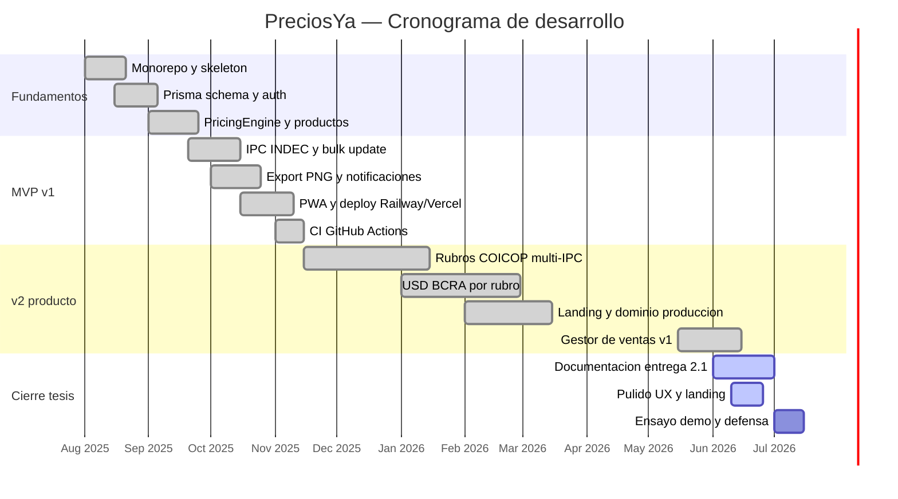

# Gantt — Proyecto PreciosYa

Cronograma del desarrollo (ago 2025 – jul 2026). Ajustar fechas exactas según acta de tesis.

## Diagrama

## Tabla por fase

| Fase | Período | Entregables |
|------|---------|-------------|
| F1 Fundamentos | Ago–Sep 2025 | Monorepo, Prisma, Auth Google |
| F2 MVP core | Sep–Nov 2025 | Productos, IPC básico, export PNG |
| F3 Deploy | Nov 2025 | Railway, Vercel, Supabase, CI |
| F4 v2 rubros/USD | Nov 2025–Mar 2026 | COICOP, BCRA, banners aplicado |
| F5 Ventas v1 | May–Jun 2026 | sales/sale_lines, UI /sales |
| F6 Documentación | Jun–Jul 2026 | docs/entrega/, manual, UML, DER |
| F7 Defensa | Jul 2026 | Presentación oral + demo live |

## Hitos clave

| Fecha | Hito |
|-------|------|
| Nov 2025 | MVP v1 funcional en staging |
| Mar 2026 | Landing + preciosya.vercel.app |
| Jun 2026 | Gestor ventas v1 en producción |
| Jul 2026 | Entrega documentación + defensa |

## Trabajo futuro (post-tesis)

Ver [ROADMAP_TESIS.md](../ROADMAP_TESIS.md) sección v2: anular ventas, insights margen, export cierre, offline.
