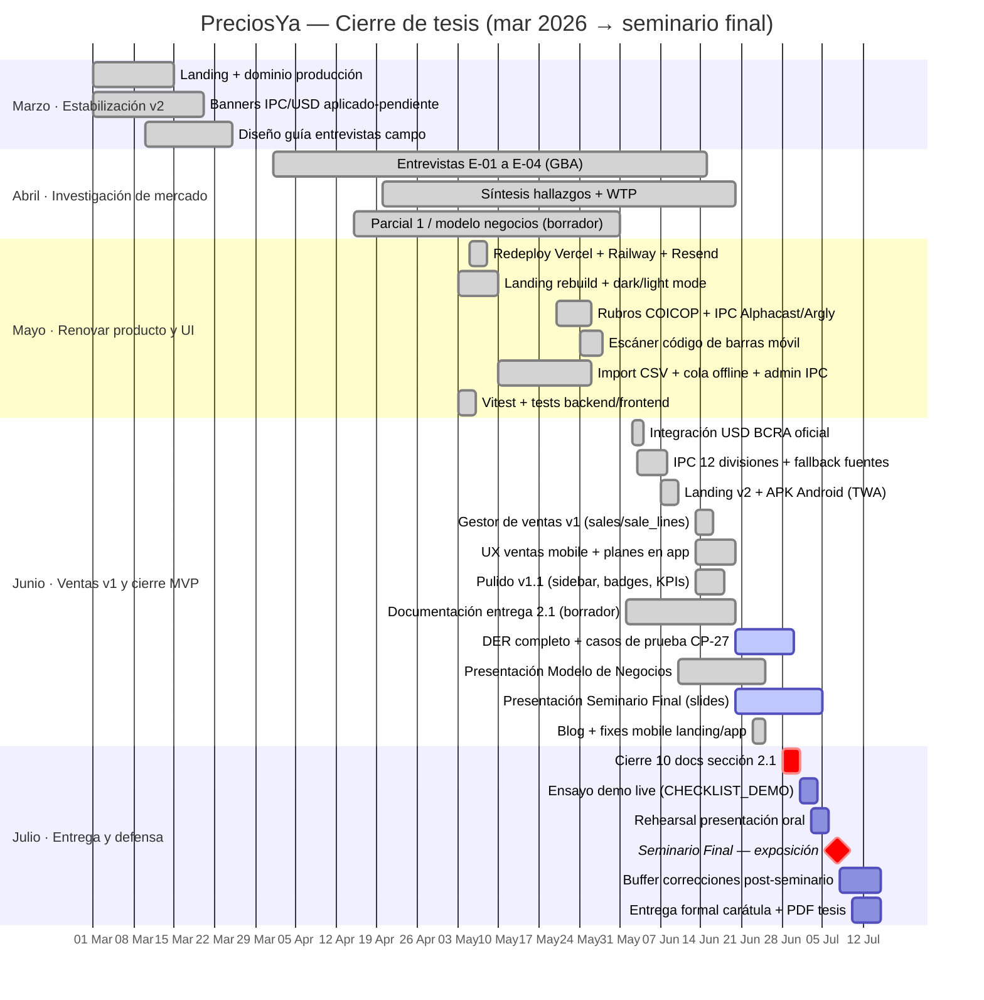
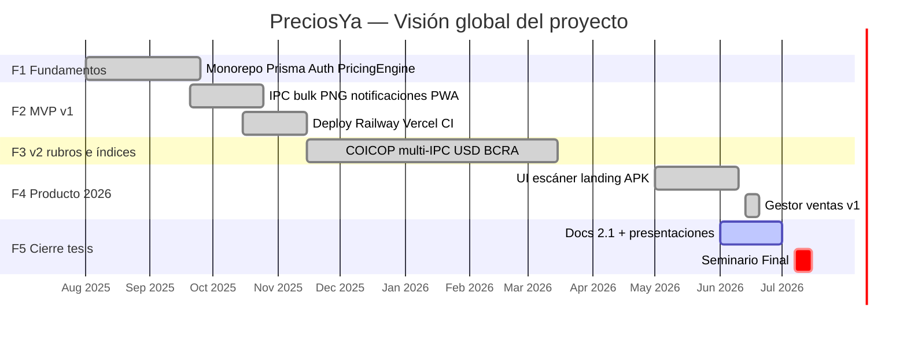

# Gantt — Proyecto PreciosYa

**Período detallado:** marzo 2026 → seminario final (julio 2026)  
**Período total:** agosto 2025 → julio 2026  
**Última actualización:** 28 jun 2026 (alineado con commits, migraciones Prisma y `docs/entrega/`)

> Para la slide de metodología / Canva: usar el diagrama **«Mar–Jul 2026»** como cronograma principal de cierre de tesis.

---

## Diagrama principal — Marzo a Seminario Final (2026)

**Leyenda Mermaid:** barras `done` = completado · `active` = en curso al 28/06 · sin etiqueta = planificado · `crit` = hito de entrega.

---

## Diagrama resumido — Proyecto completo (ago 2025 – jul 2026)

---

## Tabla detallada — Marzo a julio 2026

| Fase | Período | Entregables / hitos | Estado |
|------|---------|---------------------|--------|
| **Mar — Estabilización v2** | 01–31 mar | Landing en producción, dominio `preciosya.vercel.app`, banners IPC/USD, guía de entrevistas | ✓ Hecho |
| **Abr — Campo** | 01 abr – 15 jun | 4 entrevistas GBA (E-01…E-04), síntesis, datos WTP ~$5.500, 2 h remarcación | ✓ Hecho |
| **Abr–May — Modelo negocios** | 15 abr – 25 jun | Examen Modelos Estratégicos (17 slides, PDF entregado) | ✓ Hecho |
| **May — Renovar stack** | 03–28 may | Redeploy cloud, landing dark/light, COICOP + Alphacast/Argly, escáner, CSV, admin | ✓ Hecho |
| **Jun 1ª quincena — Índices** | 02–10 jun | BCRA USD, IPC 12 series, migraciones `bcra_usd_alert`, `local_index_applied` | ✓ Hecho |
| **Jun 2ª quincena — Ventas** | 07–20 jun | APK TWA, gestor ventas v1, migración `sales_module`, UX mobile, planes | ✓ Hecho |
| **Jun — Documentación** | 01–30 jun | Manual, CU, CP-27, UML, RF, DER (completo), arquitectura, Gantt, HTML presentación | ◐ En curso |
| **Jun — Presentaciones** | 10–30 jun | Canva Modelo Negocios ✓ · Canva Seminario Final (slides 1–10+) | ◐ En curso |
| **Jul 1 — Hito documental** | **01 jul** | **10/10 entregables `docs/entrega/` cerrados + DER sincronizado con Prisma** | ○ Planificado |
| **Jul 1–6 — Ensayo** | 01–06 jul | Checklist demo, capturas backup, ensayo oral 15–20 min | ○ Planificado |
| **Jul 7 — Seminario Final** | **~07 jul** | Exposición oral + demo en `preciosya.vercel.app` | ○ Planificado |
| **Jul 8–15 — Cierre** | 08–15 jul | Ajustes post-feedback, PDF carátula + documento maestro, buffer entrega Moodle | ○ Planificado |

---

## Hitos clave (cronología)

| Fecha | Hito | Evidencia |
|-------|------|-----------|
| 15 mar 2026 | Landing + dominio producción estable | `preciosya-landing.vercel.app` |
| Abr–jun 2026 | Validación campo n = 4 | `anexos-examen2/SINTESIS_ENTREVISTAS.md` |
| 24 may 2026 | Rubros COICOP + escáner en app | Migración `20260520120000_v2_categories_ipc_margin` |
| 02 jun 2026 | USD BCRA integrado | Migración `20260602120000_bcra_usd_alert_notif` |
| 07 jun 2026 | APK Android (TWA) + landing v2 | Commits `preciosya-app`, landing |
| **13 jun 2026** | **Gestor de ventas v1 en producción** | Migración `20260613120000_sales_module`, módulo `/sales` |
| 14 jun 2026 | Análisis docs + fixes dashboard ventas | Commit `9adc0d9f` |
| 25 jun 2026 | Presentación Modelo de Negocios lista | Examen Parcial 2 |
| **01 jul 2026** | **Cierre documentación 2.1** | `DOCUMENTO_ENTREGA_TESIS.md` + anexos |
| **~07 jul 2026** | **Seminario Final** | Presentación técnica + demo |
| 15 jul 2026 | Entrega formal tesis (carátula + PDF) | `CARATULA_TESIS.md` |

---

## Tareas por semana (referencia Canva / slide metodología)

Formato alineado al template de cronograma por fases (Iniciación → Cierre):

### Marzo 2026 — Iniciación cierre de tesis

| Tarea | Inicio | Fin | Estado |
|-------|--------|-----|--------|
| Cierre landing + dominio app | 01/03 | 15/03 | ✓ |
| Estabilizar banners IPC/USD | 01/03 | 20/03 | ✓ |
| Armar guía y consentimiento entrevistas | 10/03 | 25/03 | ✓ |

### Abril – Mayo 2026 — Planificación y ejecución producto

| Tarea | Inicio | Fin | Estado |
|-------|--------|-----|--------|
| Entrevistas en profundidad (n=4) | 01/04 | 15/06 | ✓ |
| Redeploy infra (Vercel/Railway) | 05/05 | 08/05 | ✓ |
| Rediseño UI + tema claro/oscuro | 03/05 | 10/05 | ✓ |
| IPC multi-fuente + rubros COICOP | 20/05 | 26/05 | ✓ |
| Escáner + import CSV | 10/05 | 28/05 | ✓ |
| Suite Vitest (API + shared + web) | 03/05 | 06/05 | ✓ |

### Junio 2026 — Ejecución MVP final + documentación

| Tarea | Inicio | Fin | Estado |
|-------|--------|-----|--------|
| BCRA USD + alertas | 02/06 | 04/06 | ✓ |
| IPC 12 divisiones + fallback | 03/06 | 08/06 | ✓ |
| APK TWA + landing comercial | 07/06 | 10/06 | ✓ |
| Gestor ventas v1 | 13/06 | 16/06 | ✓ |
| Pulido mobile ventas y planes | 13/06 | 20/06 | ✓ |
| DER + CP-27 + docs 2.1 | 01/06 | 30/06 | ◐ |
| Slides Seminario Final | 20/06 | 05/07 | ◐ |
| Slides Modelo de Negocios | 10/06 | 25/06 | ✓ |

### Julio 2026 — Monitoreo, ensayo y cierre

| Tarea | Inicio | Fin | Estado |
|-------|--------|-----|--------|
| **Cierre 10 documentos 2.1** | **28/06** | **01/07** | ○ |
| Checklist pre-demo (`CHECKLIST_DEMO.md`) | 01/07 | 04/07 | ○ |
| Ensayo oral + timing 15–20 min | 03/07 | 06/07 | ○ |
| **Seminario Final (exposición)** | **07/07** | **07/07** | ○ |
| Ajustes post-seminario / feedback docente | 08/07 | 12/07 | ○ |
| Export PDF carátula + documento maestro | 10/07 | 15/07 | ○ |

> **Fecha seminario:** si el profesor confirma otro día en julio, mover el hito `jul4` y las tareas `jul2`–`jul6` en bloque. Mantener **01/07** como cierre documental fijo.

---

## Tabla por fase (visión global)

| Fase | Período | Entregables |
|------|---------|-------------|
| F1 Fundamentos | Ago–Sep 2025 | Monorepo, Prisma, Auth Google, PricingEngine |
| F2 MVP core | Sep–Nov 2025 | Productos, IPC básico, export PNG, notificaciones |
| F3 Deploy | Nov 2025 | Railway, Vercel, Supabase, CI GitHub Actions |
| F4 v2 rubros/USD | Nov 2025–Mar 2026 | COICOP, BCRA, banners aplicado/pendiente |
| F5 Producto 2026 | May–Jun 2026 | Escáner, landing, APK, gestor ventas v1 |
| F6 Documentación | Jun–**01 Jul 2026** | `docs/entrega/` completo (10 ítems 2.1) |
| F7 Seminario Final | **01–15 Jul 2026** | Presentación Canva + demo live + entrega PDF |

---

## Trabajo futuro (post-seminario / v2)

No forma parte del Gantt de cierre de tesis. Ver [ROADMAP_TESIS.md](../ROADMAP_TESIS.md):

- Anular/editar ventas  
- Insights margen-real y «qué subir de precio»  
- Export cierre del día  
- Mercado Pago automático (sandbox explorado jun 2026, fuera de v1)

---

## Trazabilidad

- **Commits:** `git log --since=2026-03-01`  
- **Migraciones:** `apps/api/prisma/migrations/`  
- **Entregables:** [README.md](./README.md) · [DOCUMENTO_ENTREGA_TESIS.md](./DOCUMENTO_ENTREGA_TESIS.md)  
- **Demo:** [CHECKLIST_DEMO.md](./CHECKLIST_DEMO.md)
