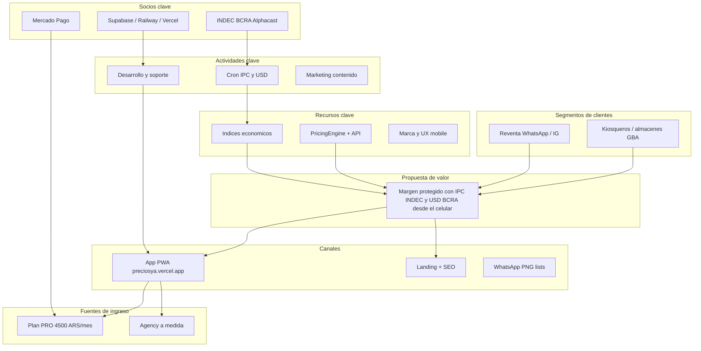
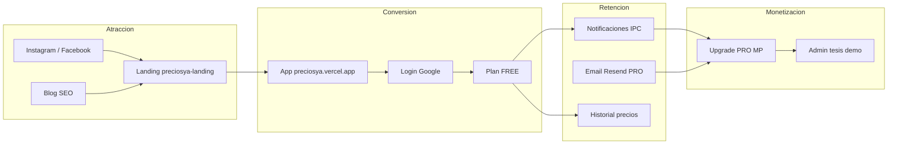

# PreciosYa — Modelo de negocios, viabilidad y marketing digital

**Segundo examen parcial · Modelos Estratégicos de Negocios**  
**Integrante:** VILLANUEVA, Lautaro Nahuel  
**Docente:** Brenda Daiana LARRETA · Sexto cuatrimestre 2026

> **Exportación:** Unir con [CARATULA_EXAMEN2.md](./CARATULA_EXAMEN2.md) y anexos en `anexos-examen2/` en un único PDF para Moodle.

---

## 1. Resumen ejecutivo del Parcial 1 (actualizado a PreciosYa 2026)

En el **primer parcial** se presentó PreciosYa como startup SaaS Freemium fundada por un único emprendedor (Monotributo, proyección SAS), orientada a kiosqueros y almaceneros del GBA abrumados por la inflación. El diagnóstico de **Porter** ubicó la **amenaza de sustitutos** (papel, Excel, inercia) como la fuerza dominante, y la estrategia genérica elegida fue **enfoque/concentración** en un nicho hiperlocal. Se definió el segmento principal, la Buyer Persona «José Pepe García» y un plan de investigación cualitativa (10–15 entrevistas).

**Actualización respecto del Parcial 1 entregado (junio 2026):**

| Tema Parcial 1 (original) | Estado actual PreciosYa |
|---------------------------|-------------------------|
| IPC único vía API INDEC | **IPC multi-serie** por rubro COICOP/INDEC + fuentes Alphacast/Argly |
| Export PNG/PDF | **PNG** en producción (WhatsApp); PDF fuera de alcance v1 |
| Modo offline con sync bidireccional | **PWA** con soporte offline limitado (lectura/caché v1) |
| Sin mención USD | **Indexar USD** por rubro con variación diaria **BCRA** |
| Sin gestor de ventas | **Gestor de ventas** (registro rápido, sin POS/caja/stock) |
| MVP planificado | **MVP v1/v2 en producción:** `preciosya.vercel.app` + API Railway |
| Integrante Pugliese | **Autor único:** Villanueva (cambio de equipo) |
| Cobro Pro genérico | **$4.500/mes** vía Mercado Pago Suscripciones (sandbox tesis) |

**Producto hoy:** PreciosYa no es un POS. Es un **gestor de precios y márgenes** mobile-first que automatiza el cálculo de venta, aplica **IPC por rubro** o **dólar oficial** donde corresponde, alerta márgenes bajos, exporta listas PNG, escanea códigos de barras y registra ventas con snapshot de rentabilidad. Planes: **FREE** (30 productos, 1 local), **PRO** ($4.500), **AGENCY** (a medida).

**Conclusión del parcial:** El proyecto mantiene viabilidad estratégica; la ejecución técnica validó las hipótesis de campo y amplió el alcance funcional (IPC multi-rubro, USD, ventas). Este segundo parcial profundiza empresa, clientes, FODA, Canvas, números y marketing digital.

---

## 2. La empresa

### 2.1 Misión, visión y valores

**Misión:** Devolver control y tranquilidad financiera al comerciante minorista argentino, automatizando precios y márgenes frente a la inflación desde el celular.

**Visión:** Ser la herramienta de referencia en Argentina para la **protección del margen** en negocios de proximidad, sin la complejidad de un ERP o POS.

**Valores:**

- **Simplicidad:** Curva de aprendizaje casi nula; WhatsApp como referente de UX.
- **Transparencia:** Índices oficiales (INDEC, BCRA), historial auditable de precios.
- **Empatía local:** Diseño pensado para mala conectividad y realidad del kiosco.
- **Bootstrap responsable:** Infra mínima, Freemium sostenible.

### 2.2 Microambiente

| Actor | Relación | Impacto |
|-------|----------|---------|
| Comerciantes (kiosco/almacén) | Clientes directos | Adopción, feedback, churn |
| Proveedores mayoristas (Arcor, etc.) | Indirectos | Disparan remarcación; no integración API |
| POS competidores (Líder, MaxiKiosco) | Sustitutos parciales | Pesados, no especializados en margen+IPC |
| INDEC / BCRA | Fuentes de índices | Legitimidad del ajuste automático |
| Mercado Pago | Cobro suscripciones | Conversión Pro |
| Railway, Supabase, Vercel | Infra | Costo fijo bajo |

### 2.3 Macroambiente — PESTEL

| Factor | Análisis |
|--------|----------|
| **Político** | Política de precios referenciales; comunicados UKRA/CAME sobre aumentos. Oportunidad: herramienta de reacción rápida. |
| **Económico** | Inflación alta estructural; dólar oficial relevante en costos importados. Motor de demanda del producto. |
| **Social** | Inclusión digital (BCRA 2025): WhatsApp y Mercado Pago ya adoptados en kioscos. |
| **Tecnológico** | PWA, APIs abiertas, escáner móvil; barrera técnica baja para imitadores. |
| **Ecológico** | Impacto neutro/bajo; menos papel en listas si adoptan PNG digital. |
| **Legal** | Monotributo/SAS; LGPD datos personales vía Supabase; no emite facturas (no compite con AFIP). |

---

## 3. Los clientes

### 3.1 Investigación de mercado

Se ejecutó el plan del Parcial 1 en versión reducida: **4 entrevistas en profundidad** en GBA (conveniencia), guía semiestructurada y observación del proceso de remarcación. Detalle en [anexos-examen2/SINTESIS_ENTREVISTAS.md](./anexos-examen2/SINTESIS_ENTREVISTAS.md).

**Hallazgos clave:**

- **3 h/semana** promedio en remarcación manual.
- **75%** admitió ventas al costo o por debajo al menos una vez.
- **50%** no usa el IPC de forma sistemática; **50%** ajusta rubros importados “al dólar” sin fórmula clara.
- Disposición a pagar: **$3.000–$5.000/mes** si ahorra ~8 h/mes → alinea con Pro **$4.500**.
- Obstáculos: resistencia al cambio, miedo a software “de facturación”, mala señal en el fondo del local.

### 3.2 Segmentación (actualizada)

**Segmento 1 (principal):** Kiosqueros y almaceneros GBA/interior urbano, 35–65 años, estrés inflacionario, uso intensivo de WhatsApp/Mercado Pago.

**Segmento 2 (secundario):** Reventa por redes (18–40 años); valoran export PNG y plan Free; menor disposición a pago.

**Funcionalidades insignia 2026:**

- S1: IPC por rubro + USD BCRA + alertas + escáner.
- S2: Export PNG + catálogo flexible sin barras obligatorias.

### 3.3 Buyer Persona — José «Pepe» García (refinada)

| Atributo | Detalle |
|----------|---------|
| Edad | 47 años |
| Negocio | Kiosco propio 20 años, Lomas de Zamora |
| Tecnología | Solo celular; WhatsApp, Mercado Pago; rechaza apps pesadas |
| Dolor | 2–4 h/semana remarcando; miedo a vender a pérdida |
| **Nuevo 2026** | Algunos productos “van con el dólar”; anota ventas en cuaderno aparte |
| Objetivo | Saber cuánto gana por producto sin cuentas mentales |

### 3.4 Mapa de empatía (José)

| Dimensión | Contenido |
|-----------|-----------|
| **Piensa/siente** | «Trabajo 12 h y la plata rinde menos»; frustración con sistemas contables |
| **Ve** | Carteles tachados; locales que cierran; supermercados que actualizan rápido |
| **Oye** | Grupo WhatsApp comerciantes: «Arcor subió 15%»; contador: «la mineral casi al costo» |
| **Dice/hace** | «Le subo un poco a ojo»; calculadora en mostrador |
| **Esfuerzos** | Tiempo, conectividad, miedo a tecnología |
| **Ganancias deseadas** | Tranquilidad al cerrar el local; margen claro por producto |

**Vínculo con producto:** PreciosYa responde con cálculo automático, IPC/USD por rubro, alertas rojas, PWA móvil, PNG para WhatsApp y gestor de ventas sin la fricción de un POS.

---

## 4. FODA

| **Fortalezas** | **Debilidades** |
|----------------|-----------------|
| Nicho hiperespecífico (margen + inflación AR) | Marca nueva, sin marketing pago |
| IPC multi-rubro + USD BCRA integrados | Dependencia de APIs externas |
| Freemium + barrera de salida (historial) | Offline aún limitado vs promesa ideal |
| Stack moderno bajo costo (Railway/Vercel) | Equipo de una persona |
| PWA + escáner + gestor ventas | MP sandbox incompleto en tesis |

| **Oportunidades** | **Amenazas** |
|-------------------|--------------|
| Inflación estructural sostiene el dolor | Sustituto gratuito: papel/Excel |
| Digitalización kioscos (MP, QR) | POS locales agregan features |
| Contenido SEO «cómo remarcar» | Nuevos entrantes low-code |
| Alianzas gremiales (UKRA, CAME) | Cambio regulatorio o freno IPC |

**Estrategia derivada:** SO — usar fortalezas técnicas (índices oficiales, UX simple) para captar oportunidad de educación digital; WO — contenido y Freemium para compensar debilidad de marca; ST — retención por historial frente a sustitutos; WT — no competir en facturación ni POS.

---

## 5. Business Model Canvas

### 5.1 Los nueve bloques

| Bloque | PreciosYa |
|--------|-----------|
| **Segmentos** | Kiosqueros/almaceneros AR (principal); reventa redes (secundario) |
| **Propuesta de valor** | Proteger margen con IPC/USD oficiales, mobile-first, sin complejidad POS |
| **Canales** | Web app PWA, landing, WhatsApp (PNG/share), SEO blog, redes |
| **Relación** | Self-service, notificaciones in-app, email IPC (Pro), soporte mailto Agency |
| **Fuentes de ingreso** | Suscripción Pro $4.500/mes; Agency custom |
| **Recursos clave** | PricingEngine, datos IPC/BCRA, marca, código monorepo |
| **Actividades clave** | Desarrollo producto, fetch índices, onboarding Free, contenido educativo |
| **Socios clave** | Supabase, Railway, Vercel, Alphacast, Mercado Pago, INDEC/BCRA |
| **Estructura de costos** | Infra cloud ~$25–40k/mes; tiempo fundador; comisiones MP |

### 5.2 Diagrama

---

## 6. Costos, ingresos y viabilidad

Resumen; desarrollo numérico en [anexos-examen2/COSTOS_VIABILIDAD.md](./anexos-examen2/COSTOS_VIABILIDAD.md).

### 6.1 Ingresos

- **FREE:** adquisición y retención; límite 30 productos / 1 local.
- **PRO:** **$4.500 ARS/mes** — catálogo ilimitado, 3 locales, IPC/USD completo, dashboard ventas, emails IPC.
- **AGENCY:** precio comercial personalizado.

### 6.2 Costos

- Infraestructura cloud: **~$40.000 ARS/mes** (escenario conservador).
- Variable: comisión Mercado Pago ~3,5% sobre Pro cobrado.
- Sin costo de adquisición pago en fase tesis (orgánico + boca a boca).

### 6.3 Punto de equilibrio

Margen de contribución Pro ≈ **$4.342/mes** → equilibrio con **~10 suscriptores Pro**.

### 6.4 Mínimo viable económico (MVE)

**10 clientes Pro** cubren infra; meta realista año 1 con 500 usuarios Free y conversión 2%. El MVE valida sostenibilidad técnica antes de salario del fundador.

**Conclusión:** Viabilidad **moderada-alta** en nicho; riesgo principal es adopción frente a sustitutos gratuitos, no el margen unitario.

---

## 7. Marketing digital

### 7.1 Marketing mix (4P)

| P | Estrategia PreciosYa |
|---|----------------------|
| **Producto** | SaaS web PWA: precios, IPC/USD, alertas, PNG, escáner, ventas lite |
| **Precio** | Freemium; Pro $4.500/mes (&lt;0,5% ingreso kiosco); ancla de valor = horas ahorradas |
| **Plaza** | 100% digital: Vercel + link directo; sin distribución física |
| **Promoción** | Contenido educativo, testimonios landing, grupos WhatsApp comerciantes, SEO blog |

### 7.2 Ecosistema digital

**Piezas centrales:** landing pública, app producto, blog (8 temas planificados), redes sociales, notificaciones/e-mail.

### 7.3 Embudo de conversión

| Etapa | Acción | Métrica |
|-------|--------|---------|
| **TOFU** | Posts educativos («¿Sabés tu margen?») | Alcance, clics landing |
| **MOFU** | Carrusel «No es un POS», primera nota blog | Registros Google OAuth |
| **BOFU** | Límite 30 productos + CTA Pro en app | Trial → pago MP |
| **Retención** | Banner IPC nuevo, alertas margen | DAU, churn mensual |

Piezas creativas: [anexos-examen2/PIEZAS_CONTENIDO.md](./anexos-examen2/PIEZAS_CONTENIDO.md).

### 7.4 Blog — 8 temas + primera nota

Temario y artículo completo #1 en [anexos-examen2/BLOG_PRIMERA_NOTA.md](./anexos-examen2/BLOG_PRIMERA_NOTA.md).

**Temas:** (1) calcular precio con margen, (2) qué es IPC, (3) IPC por rubro, (4) indexar USD, (5) errores que hacen perder plata, (6) lista WhatsApp PNG, (7) Free vs Pro, (8) gestor ventas sin POS.

---

## Anexos (orden sugerido en PDF único)

1. [CARATULA_EXAMEN2.md](./CARATULA_EXAMEN2.md)
2. [anexos-examen2/GUIA_ENTREVISTAS.md](./anexos-examen2/GUIA_ENTREVISTAS.md)
3. [anexos-examen2/SINTESIS_ENTREVISTAS.md](./anexos-examen2/SINTESIS_ENTREVISTAS.md)
4. [anexos-examen2/COSTOS_VIABILIDAD.md](./anexos-examen2/COSTOS_VIABILIDAD.md)
5. [anexos-examen2/PIEZAS_CONTENIDO.md](./anexos-examen2/PIEZAS_CONTENIDO.md)
6. [anexos-examen2/BLOG_PRIMERA_NOTA.md](./anexos-examen2/BLOG_PRIMERA_NOTA.md)
7. [anexos-examen2/BIBLIOGRAFIA.md](./anexos-examen2/BIBLIOGRAFIA.md)

---

*Documento generado junio 2026 — alineado con `docs/PRECIOSYA.md` y producto en producción.*
