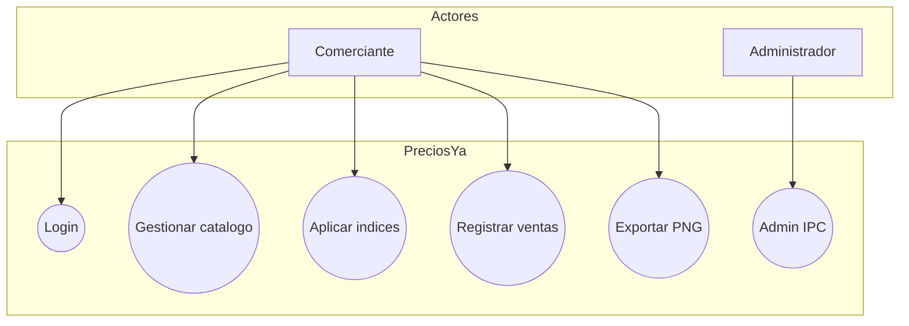
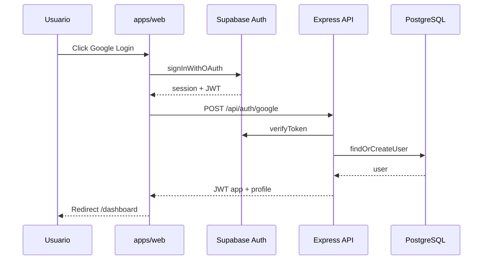
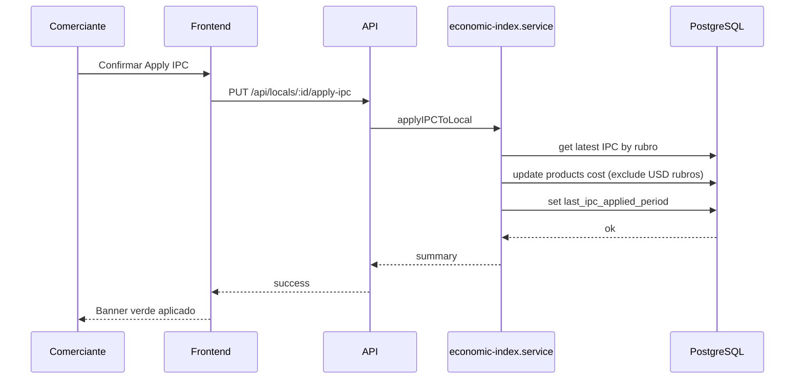
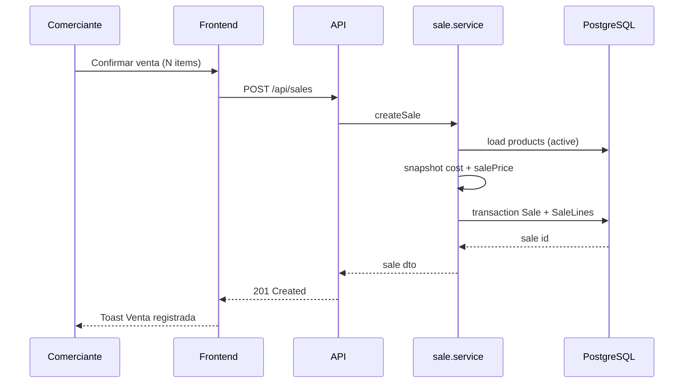
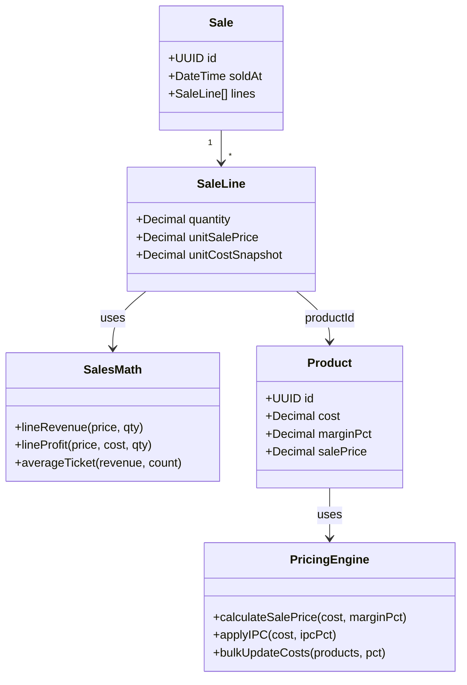
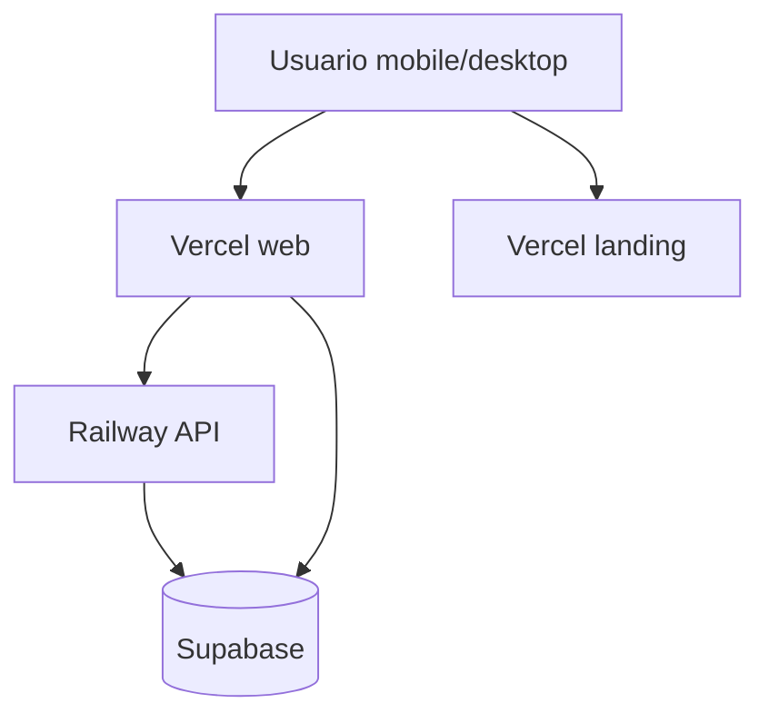

# UML — PreciosYa

Diagramas en Mermaid (exportables a PNG desde GitHub, VS Code o mermaid.live).

---

## 1. Casos de uso (resumen)

Detalle en [CASOS_DE_USO.md](./CASOS_DE_USO.md).

---

## 2. Secuencia — Login

---

## 3. Secuencia — Aplicar IPC

---

## 4. Secuencia — Registrar venta

---

## 5. Diagrama de clases — Dominio (simplificado)

Implementación: `packages/shared/src/pricing.ts`, `sales.ts`

---

## 6. Despliegue (deployment)

Ver [DISENO_ARQUITECTURA.md](./DISENO_ARQUITECTURA.md).
